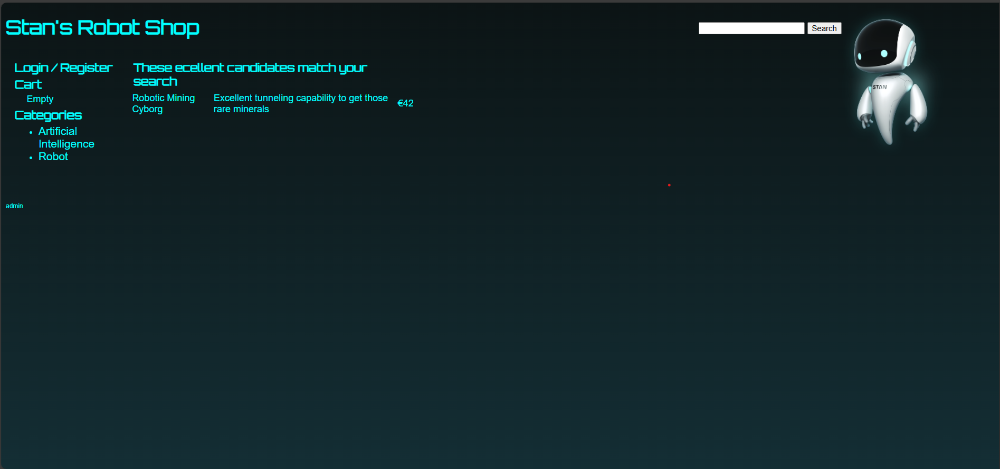
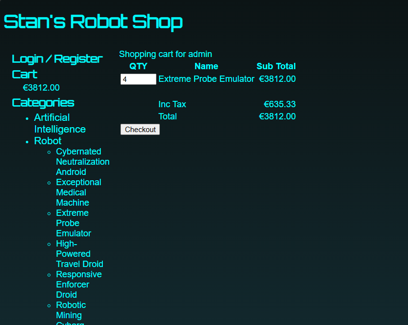

# Three TierRobot Shop Deployment Using DevSecops

Stan's Robot Shop is a sample microservice application you can use as a sandbox to test and learn containerised application orchestration and monitoring techniques. It is not intended to be a comprehensive reference example of how to write a microservices application, although you will better understand some of those concepts by playing with Stan's Robot Shop. To be clear, the error handling is patchy and there is not any security built into the application.

You can get more detailed information from my [blog post](https://www.instana.com/blog/stans-robot-shop-sample-microservice-application/) about this sample microservice application.
- Homepage of Robotshop:



---
- Cart of Robotshop:



This sample microservice application has been built using these technologies:
- NodeJS ([Express](http://expressjs.com/))
- Java ([Spring Boot](https://spring.io/))
- Python ([Flask](http://flask.pocoo.org))
- Golang
- PHP (Apache)
- MongoDB
- Redis
- MySQL ([Maxmind](http://www.maxmind.com) data)
- RabbitMQ
- Nginx
- AngularJS (1.x)

## RUN APPLICATION USING COMPOSE:
```shell
$ export INSTANA_AGENT_KEY="<your agent key>"
```

Now build all the images.

```shell
$ docker-compose build
```

If you modified the `.env` file and changed the image registry, you need to push the images to that registry

```shell
$ docker-compose push
```

## Run Locally
You can run it locally for testing.

If you did not build from source, don't worry all the images are on Docker Hub. Just pull down those images first using:

```shell
$ docker-compose pull
```

Fire up Stan's Robot Shop with:

```shell
$ docker-compose up
```

If you want to fire up some load as well:

```shell
$ docker-compose -f docker-compose.yaml -f docker-compose-load.yaml up
```

## Accessing the Store
If you are running the store locally via *docker-compose up* then, the store front is available on localhost port 8080 [http://localhost:8080](http://localhost:8080/)
